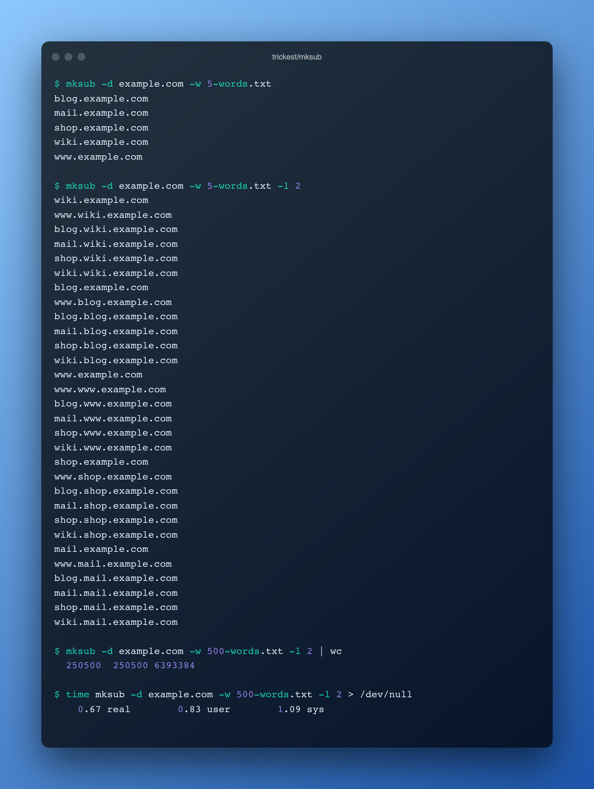

<h1 align="center">mksub <a href="https://twitter.com/intent/tweet?text=mksub%20-%20Generate%20tens%20of%20thousands%20of%20subdomain%20combinations%20in%20a%20matter%20of%20seconds%20%40trick3st%0Ahttps%3A%2F%2Fgithub.com%2Ftrickest%2Fmksub&hashtags=bugbounty,bugbountytips,infosec"></a></h1>
<h3 align="center">Generate tens of thousands of subdomain combinations in a matter of seconds</h3>



Read a wordlist file and generate subdomain combinations for a given domain or list of domains. Input from the wordlist file is lowercased and only unique words are processed. Additionally, wordlist can be filtered using regex.

When you use mksub's `-l` parameter, it will generate all subdomain combinations up to the specified level, including all lower levels, using words from the wordlist. For instance, with `-l 2`, it will generate `len(permutation_list)^2 + len(permutation_list)` results, which is:
- 30 combinations for a 5-word wordlist.
- 10100 combinations for a 100-word wordlist. 
- 250500 combinations for a 500-word wordlist.

# Installation

## Binary
Binaries are available in the [latest release](https://github.com/trickest/mksub/releases/latest).

## Docker
```
docker run quay.io/trickest/mksub
```

## From source
```
go install github.com/trickest/mksub@latest
```

# Usage
```
  -d string
        Input domain
  -df string
        Input domain file, one domain per line
  -l int
        Subdomain level to generate (default 1)
  -o string
        Output file (stdout will be used when omitted)
  -r string
        Regex to filter words from wordlist file
  -silent
        Skip writing generated subdomains to stdout (faster) (default true)
  -t int
        Number of threads for every subdomain level (default 100)
  -w string
        Wordlist file
```

# Example
### wordlist.txt
```
dev
DEV
*
foo.bar
prod
```
```shell script
$ mksub -d example.com -l 2 -w input.txt -r "^[a-zA-Z0-9\.-_]+$"
dev.example.com
foo.bar.example.com
prod.example.com
foo.bar.dev.example.com
prod.dev.example.com
dev.dev.example.com
dev.foo.bar.example.com
foo.bar.foo.bar.example.com
prod.foo.bar.example.com
dev.prod.example.com
foo.bar.prod.example.com
prod.prod.example.com
```

## Report Bugs / Feedback
We look forward to any feedback you want to share with us or if you're stuck with a problem you can contact us at [support@trickest.com](mailto:support@trickest.com). You can also create an [Issue](https://github.com/trickest/mksub/issues/new) or pull request on the Github repository.

# Where does this fit in your methodology?
Mksub is an integral part of the [Inventory](https://github.com/trickest/inventory) workflow and many other workflows in the Trickest store. Sign up on [trickest.com](https://trickest.com) to get access to these workflows or build your own from scratch!


[](https://trickest.io/auth/register)
